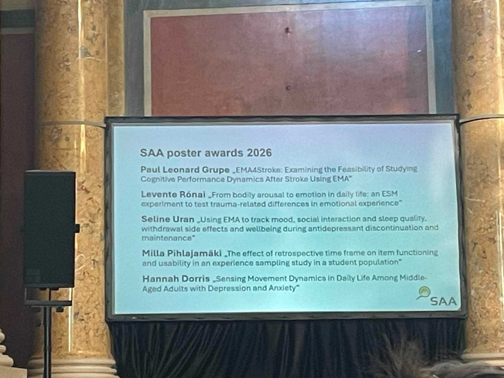

We are delighted to share that our lab member **Levente Rónai** received a Poster Award at the 2026 conference of the [Society for Ambulatory Assessment](https://univie.eventsair.com/saa2026/), held at the University of Vienna from 3–5 August 2026.

His poster, *“From bodily arousal to emotion in daily life: an ESM experiment to test trauma-related differences in emotional experience,”* was selected for the award from more than 140 posters presented at the conference.

The study combines a controlled manipulation of physiological arousal with experience sampling methodology (ESM) to investigate how bodily arousal shapes emotional experiences in everyday life and whether this relationship differs depending on previous trauma exposure. The work was co-authored by fellow lab members **Flóra Janku** and **Tamás Nagy**.

Congratulations to Levente on this outstanding achievement!